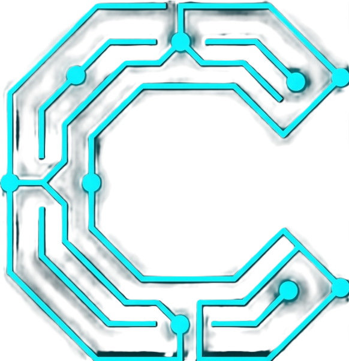

<div align="center">
  
  <h1>🚀 Conduit</h1>
  <p><b>Open Banking Intelligence & Observability Operating System</b></p>
  <p><i>The definitive revenue-linked observability platform for the modern financial ecosystem.</i></p>
</div>

---

## 🏛️ Project Overview

**Conduit** is a state-of-the-art observability platform designed for the Open Banking era. It protects every rupee flowing through your APIs by providing real-time distributed tracing, automated SLA attribution, and AI-driven remediation for financial infrastructure.

Whether you are managing UPI nodes, monitoring Account Aggregator (AA) flows, or protecting AUM from API latency, Conduit provides the critical intelligence layer for fintech architects.

## ✨ Core Features

- **🏥 API Health Hub**: Real-time distributed tracing and health metrics across your entire partner ecosystem.
- **🛡️ Revenue Shield**: Quantify the exact financial cost of API failures and latency in real-time Rupee values.
- **📊 SLA Scorecard**: Automated attribution engine that pinpoint which partner is responsible for system bottlenecks.
- **🤖 AI Resolution Engine**: Predictive models (LSTMWatch, FailGuard) that anticipate failures and trigger automated remediation.
- **🧭 Clean URL Routing**: Comprehensive navigation using **React Router** for deep-linking across every micro-service.
- **🌍 Partner Network Graph**: High-fidelity visualization of your API topology and connectivity health.
- **🎨 Premium DX**: A cinematic, high-performance interface built for mission-critical financial operations.

## 🛠️ Technology Stack

- **Framework**: [React 19](https://react.dev/)
- **Build Tool**: [Vite 6](https://vitejs.dev/)
- **Routing**: [React Router 7](https://reactrouter.com/)
- **Icons**: [Lucide React](https://lucide.dev/)
- **Data Viz**: [Recharts](https://recharts.org/) & [D3.js](https://d3js.org/)
- **Styling**: Tailwind CSS & Premium Glassmorphism Design System
- **Intelligence**: Mocked Gemini AI Service (Standalone / No-Key required)

## 🚀 Getting Started

### Prerequisites

- **Node.js** (LTS version recommended)
- **npm**

### Installation

1. **Clone the repository:**
   ```bash
   git clone <repository-url>
   cd CONDUIT-Open-Banking-Intelligence
   ```

2. **Install dependencies:**
   ```bash
   npm install
   ```

3. **Run in development mode:**
   ```bash
   npm run dev
   ```

4. **Build for production:**
   ```bash
   npm run build
   ```

## 🔐 AI & Security

Conduit is designed to run independently of external AI services for maximum reliability and privacy. The **AIAssistantConsole** and **AIResolutionEngine** are powered by an internal mock service layer, ensuring full functionality even in offline or air-gapped environments.

## 🌍 Deployment

Conduit is pre-configured for seamless deployment on major cloud hosting providers:

### Vercel
Deployment is handled automatically by the `vercel.json` configuration, ensuring all SPA routes are correctly redirected to `index.html`.

### Netlify
The `netlify.toml` file includes build settings and redirect rules to handle React Router/SPA navigation without 404 errors.

---

<div align="center">
  <p>Built with ❤️ for the Open Banking Ecosystem</p>
</div>
